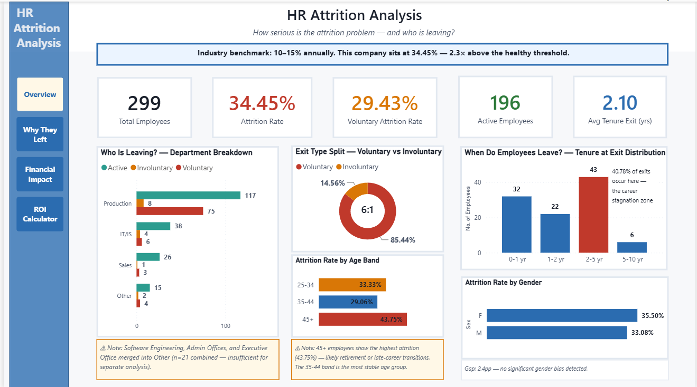
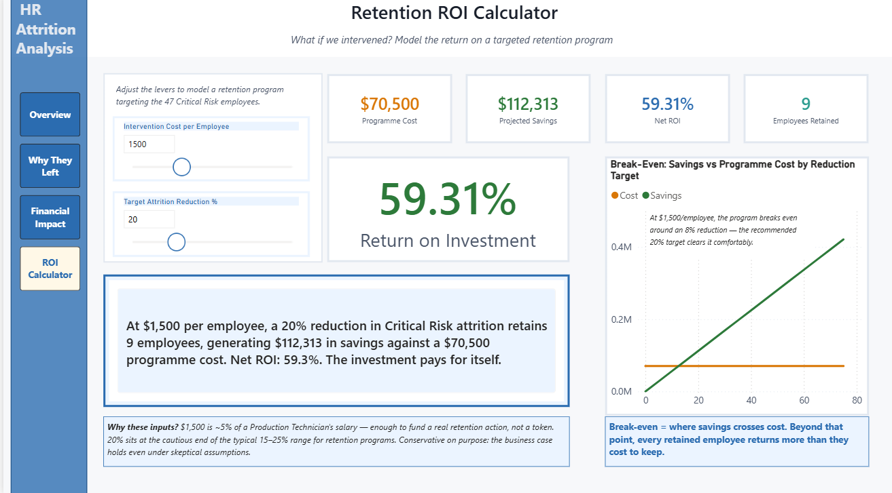
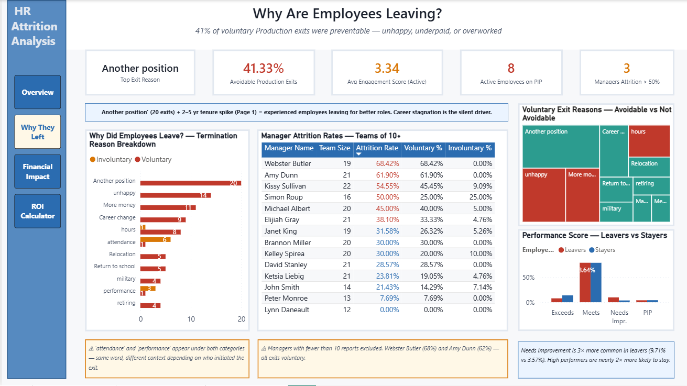
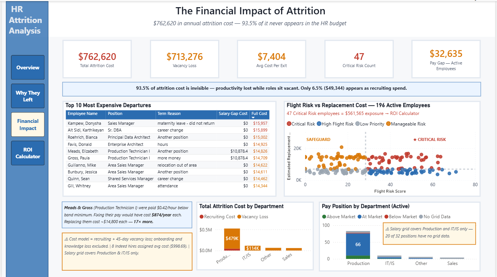

# HR Attrition Analysis — From Diagnosis to Decision

> **A 34% attrition crisis, traced to its root causes, costed at $762K, and turned into an interactive retention ROI tool.**
> Built end-to-end with Python, SQL, and Power BI.



---

## The 30-Second Version

A company is losing **1 in 3 employees every year** — more than double the healthy benchmark. This project answers four questions a leadership team would actually ask:

| Question | Answer |
|---|---|
| **How bad is it?** | 34.45% attrition — 85% of it voluntary |
| **Why are they leaving?** | 41% of voluntary Production exits were avoidable — pay, hours, unhappiness |
| **What is it costing?** | $762,620/year — and 93.5% is invisible vacancy loss |
| **What do we do?** | A recommended programme on the 47 at-risk employees returns **~59% ROI** (conservative) — up to 199% at the model's optimistic end |

---

## The Headline Insight

**Underpaying employees does not save money — it makes them the most expensive to lose.**

Two Production Technicians were paid $0.42/hour below the band minimum. Fixing their pay would have cost **$874/year each**. Replacing them after they quit cost **~$14,800 each — 17× more.**

> **A note on rigour:** during dashboard QA I caught a date-parsing bug that had silently misread one-third of the birth-year data — which had inverted the original age finding. Catching, fixing, and documenting it is part of the project. [See the write-up in the notebook.](HR_Attrition_Analysis.ipynb)

---

## Interactive ROI Calculator

The centerpiece is a **What-If retention model**. Move two sliders — intervention cost and target reduction — and every number recalculates live: programme cost, projected savings, employees retained, and net ROI against a break-even curve.



> **The PDF and screenshots show default values only.**
> **To use the live calculator, [download the `.pbix` dashboard file](#whats-in-this-repo) and open it in Power BI Desktop (free).**

**Recommended scenario — $1,500 per employee, 20% reduction.** These inputs are deliberately conservative: $1,500 is about 5% of a technician's salary (enough to fund a real retention action, not a token gesture), and 20% sits at the cautious end of the 15–25% range typical of retention programmes. The result: **9 employees retained, $112,313 saved on a $70,500 spend — a 59% ROI.**

The dashboard opens on this recommended scenario. The sliders remain fully interactive — push the intervention cost down or the reduction target up and ROI climbs toward 199% at the model's optimistic end. The point of the calculator is to let you stress-test the business case, not just read one number.

---

## More Views

<details>
<summary><b>Page 2 — Why Are They Leaving?</b> (click to expand)</summary>



Termination reasons, performance patterns (leavers are 3× more likely to be underperformers), and a manager league table exposing two managers losing staff at double the company rate.
</details>

<details>
<summary><b>Page 3 — The Financial Impact</b> (click to expand)</summary>



The cost engine and a flight-risk quadrant scoring all 196 active employees — identifying the 47 "Critical Risk" staff worth $561K in replacement exposure.
</details>

---

## How It Was Built

```
Raw CSVs  →  Python / pandas  →  DuckDB SQL  →  Power BI
 (4 files)     cleaning & QA      analysis        dashboard
```

- **Python (pandas)** — cleaned 4 linked datasets; caught a date-parsing bug that had silently corrupted one-third of the age data
- **DuckDB SQL** — attrition rates, a replacement-cost engine built on real recruiting spend, and a weighted flight-risk score
- **Power BI** — 4-page dashboard with a live ROI calculator, custom theme, and documented data limitations

---

## What's in This Repo

| File | What it is |
|---|---|
| `HR_Attrition_Dashboard.pbix` | **The interactive dashboard — download to use the live ROI calculator** |
| `HR_Attrition_Dashboard.pdf` | Static preview of all 4 pages |
| `HR_Attrition_Analysis.ipynb` | Full Python + SQL pipeline, documented step by step |
| `HR_Attrition_Presentation.pptx` | Executive summary deck with recommendations |
| `/data/` | The four source CSV files |
| `/screenshots/` | Dashboard page images used in this README |

---

## Skills Demonstrated

`Data Cleaning` · `SQL (DuckDB)` · `Python / pandas` · `Cost Modelling` · `Risk Segmentation` · `Power BI` · `DAX` · `Data Storytelling` · `Stakeholder Communication`

---

*Dataset: HRDataset v13 (Kaggle). A portfolio project demonstrating an end-to-end business analytics workflow — from raw data to a decision-ready tool.*
